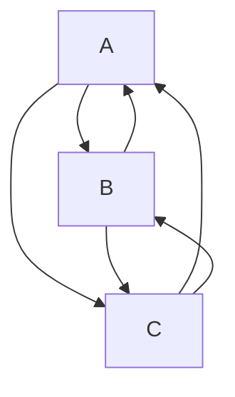

# Set Cover Combinatorial Optimization

> Sidharrth Nagappan, 2022

The set cover problem is a combinatorial optimization problem. The problem is to find the smallest set of sets that covers all elements of a given N-range. For example, suppose we have a range of 15 elements and 6 sets, each of which contains a subset of the universe. The goal is to find the smallest combination of sets that covers all elements of the range.

Since the problem is NP-hard, we have to use a heuristic algorithm to solve and there exists no theoretically polynomial time algorithm.

In this notebook, I will attempt to solve the set cover problem using the following algorithms:
1. Naive Greedy
2. Greedy with a better cost function
3. A* Traversal Using a Priority Queue
3. A* Traversal Using a Fully Connected Graph and over-complicating things

## Naive Greedy

The greedy algorithm essentially traverses through a sorted list of subsets and keeps adding the subset to the solution set if it covers any new elements. The algorithm is very naive as it does not take into account the number of new elements.

```python
def naive_greedy(N):
    goal = set(range(N))
    covered = set()
    solution = list()
    all_lists = sorted(problem(N, seed=42), key=lambda l: len(l))
    while goal != covered:
        x = all_lists.pop(0)
        if not set(x) < covered:
            solution.append(x)
            covered |= set(x)

    print(
        f"Naive greedy solution for N={N}: w={sum(len(_) for _ in solution)} (bloat={(sum(len(_) for _ in solution)-N)/N*100:.0f}%)"
    )
```

## Smarter Greedy Algorithm With a Basic Heuristic Function

In real-life scenarios, the cost depends on the relative price of visiting a node/choosing an option. Since we consider all options to be arbitrarily priced, we use a constant cost of 1. This version of the greedy algorithm takes the subset with the lowest $f$ where:

- $S_e$ is the expected solution (containing all the unique elements)
- $n_i$ is the current subset
- The cost is set to 1 here, since there is no "business" cost associated with choosing a subset

$$f_i = 1 / |n_i - S_e|$$

The algorithm for this solution was referenced from GeeksForGeeks.

## A* Traversal

The A* algorithm requires a monotonic heuristic function that symbolises the remaining distance between the current state and the goal state. In the case of the set cover problem, the heuristic function is the number of elements that are not covered by the current solution set. The algorithm is implemented using a priority queue. There are two ways of implementing A*, we can either:

1. build a fully connected graph and use an open and closed list to traverse
2. use a priority queue

We can either use a constant cost (as used earlier) or vary it based on the length of the upcoming set. The latter is computationally expensive and slow.

For learning purposes, I will implement both, even though the second method is more efficient.

### How does an A* traversal work?

The A* algorithm is a graph traversal algorithm that uses a priority queue to traverse the graph. The algorithm works by:
1. Adding the start node to the priority queue
2. While the state is not None, cycle through the subsets and compute the cost of adding this subset to the final list.
3. If the cost has not been stored yet and the the new state is not in the queue, update the parent of each state. If travelling in this route produces a cheaper cost, update the cost of the node and its parent.
4. Finally, compute the path we travelled through.

### Why are we building a fully connected graph?

An initial idea I had was to build a fully connected graph where each subset is in it's own node.

Given A = $[2, 4, 5]$, B = $[2, 3, 1]$ and C = $[1, 2]$,



The heuristic function is slightly different:

$$h_i = len(s_i) - len(s_i \cap S_e)$$

where $s_i$ is the current subset and $S_e$ is the expected solution. It takes into account both the length of the new subset (to minimise final weight) and the number of undiscovered elements that it can contribute.

### Provisional Results

### Smart Greedy (With Heuristic Guessing)

| N | w | bloat | visited nodes |
|---|---|-------|---------------|
| 5 | 5 | 0% | 3 |
| 10 | 11 | 10% | 3 |
| 50 | 99 | 98% | 5 |
| 100 | 192 | 92% | 5 |
| 500 | 1313 | 163% | 7 |
| 1000 | 3092 | 209% | 8 |

#### A* Traversal
| N | w | bloat | visited nodes | visited states |
|---|---|-------|---------------|----------------|
| 5 | 5 | 0% | 4 | 59 |
| 10 | 10 | 0% | 5 | 191
| 20 | 23 | 15% | 934 | 40216 |
| 50 | (blow up) | (blow up) | (blow up) | (blow up) |

### A* Traversal Using Uniform Cost of 1 (Not affected by subset length)

| N | w | bloat | visited nodes | visited states |
|---|---|-------|---------------|----------------|
| 5 | 5 | 0% | 3 | 34 |
| 10 | 14 | 40% | 4 | 141 |
| 20 | 35 | 75% | 5 | 134 |
| 50 | 85 | 70% | 5 | 134 |
| 100 | 203 | 103% | 6 | 2127 |
| 500 | 1430 | 186% | 8 | 12652 |
| 1000 | 3268 | 227% | 9 | 28941 |

### A* Traversal Using a Fully Connected Graph (Possibly Overcomplicating Things)

| N | w | bloat |
|---|---|-------|
| 5 | 5 | 0% |
| 10 | 10 | 10% |
| 20 | 33 | 65% |
| 50 | 157 | 214% |
| 100 | 297 | 197% |

### Disclaimers

I worked with Erik Bengsston and Ricardo Nicida.

