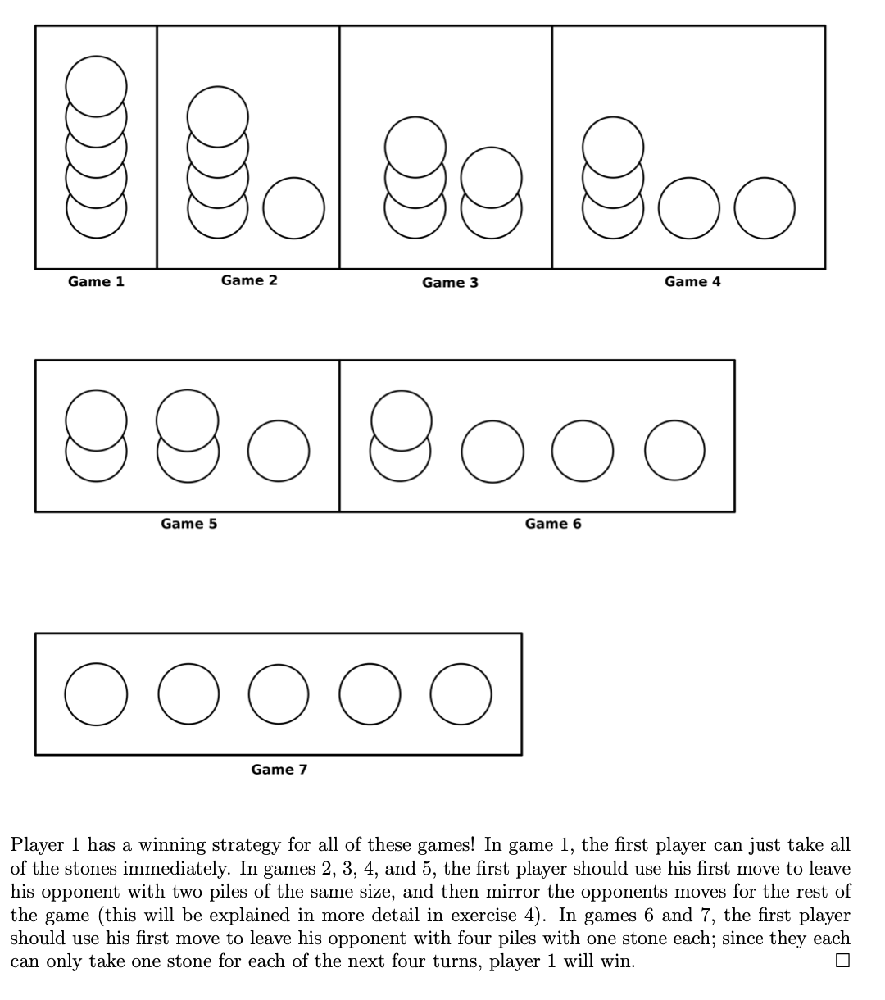

# Nim Policy Search

Nim is a simple game where two players take turns removing objects from a pile. The player who removes the last object loses. The game is described in detail [here](https://en.wikipedia.org/wiki/Nim). There is a mathematical strategy to win Nim, by ensuring you always leave the opponent with a nim-sum number of objects (groups of 1, 2 and 4).

In this notebook, we will play nim-sum using the following agents:
1. An agent using fixed rules based on nim-sum
2. An agent using evolved rules
3. An agent using minmax
4. An agent using reinforcement learning (both temporal difference learning and monte carlo learning)

## Rules

We came up with multiple rules, through discussion with friends and through research papers that define fixed rules for playing Nim. There are currently 4 rules that we have implemented. The rules are as follows:
1. If one pile, take x number of sticks from the pile.
2. If two piles:
    a. If 1 pile has 1 stick, take x sticks
    b. If 2 piles have multiple sticks, take x sticks from the larger pile
3. If three piles and two piles have the same size, remove all sticks from the smallest pile
4. If n piles and n-1 piles have the same size, remove x sticks from the smallest pile until it is the same size as the other piles

<p align="center">

</p>
<p align="center">Figure 1: Rules for playing Nim (Ryan Julius)</p>

### Task 3.1: Fixed Rules

#### Approach 1: A Lot of If-Elses

The above rules are applied directly. An if-else sequence decides which strategy to employ based on the current layout and statistics on the nim board.

#### Approach 2: Nim-Sum

Will always win
### Task 3.2: Evolved Rules

#### Approach 1: Evolving hyperparameters of strategies for different board layouts (Rule-Strategy Evolution)

The rules are evolved using a genetic algorithm. A dictionary of strategies is evolved. The key is the rule (scenario/antecedent). The value is the maximum number of sticks to leave on the board in this scenario.

For instance, for rule 1, the value tuned is the $x$ in "If one pile, leave a max of x sticks in the pile".

```python
rule_strategy = {
    "one_pile": 2,
    "two_piles": 3,
    "three_piles": 3,
    "n_piles": 4
}

# after mutation / crossover
rule_strategy = {
    "one_pile": 3,
    "two_piles": 2,
    "three_piles": 3,
    "n_piles": 4
}
```

Mutation essentially swaps the values in the dictionaries. Crossover takes two parents and randomly chooses strategies for different rules. **Intuitively, the machine tries to learn the best strategy for each scenario on the board.**

| Opponent 1 | Opponent 2 | Win Rate |
|------------|------------|----------|
| Evolved    | Random     | 70%      |

#### Approach 2: Evolving probabilities of choosing different strategies

Strategies were originally chosen based on probability thresholds and a random number. The list of probabilities (thresholds) are evolved using a genetic algorithm. **Intuitively, the machine tries to learn the best probability of choosing each strategy, regardless of the rule.**

```python
thresholds = [p1, p2, p3]
if random.random() < p1:
    # strategy 1...
elif random.random() < p2:
    # strategy 2...
else:
    # strategy 3...

class GA:
    ...

GA.evolve(thresholds)
```

I discussed this approach with both Prof. Squillero and Calabrese. They both agreed that this was worth exploring. However, upon implementing, I realised that tuning probability thresholds produces poor, near-random performance, **as the system is making decisions without any knowledge of the current situation on the board, or any knowledge of the rules**.

You can check out the code for this in the notebook (not refined yet).

### Task 3.3: Minmax

In `minmax.py`, the minimax algorithm is implemented. It recursively traverses the game tree to maximise potential returns. As a result, it is a near-optimal strategy that reported `100%` win rate against random opponents.

Since the recursive algorithm is slow:
1. The tree is pruned momentarily, stopping the algorithm from exploring parts of the tree that will not materialise on the game board.
2. A maximum depth is set, so that the recursive loop is stopped when a particular depth is reached.

Although not significant, an `@lru_cache` decorator is applied on the minmax operation after ensuring that the Nim state (row composition) is serializable.

### Task 3.4: Reinforcement Learning

Both temporal difference learning (TDL) and monte carlo learning (MCL) are implemented. In TDL, the Q values are updated after each move. In MCL, the learning is episodic so a goal dictionary is traversed backwards during learning.

<p align="center">

</p>
<p align="center">Value Update Functions for both approaches (From Huggingface)</p>

#### Using Temporal Difference Learning


#### Using Monte Carlo Learning


### Acknowledgements

I have discussed with Karl Wennerstrom and Diego Gasco.